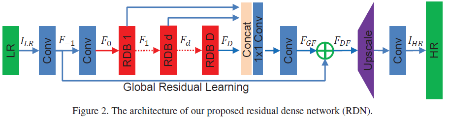
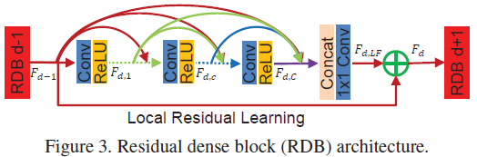

# Residual Dense Network (RDN) (Caffe)

This is the implementation of paper: "Y. Zhang, Y. Tian, Y. Kong, et al., 2018. Residual dense network for image super-resolution. CVPR, p.2472-2481." [PDF](http://openaccess.thecvf.com/content_cvpr_2018/papers/Zhang_Residual_Dense_Network_CVPR_2018_paper.pdf)

## Environment

- OS: CentOS 7 Linux kernel 3.10.0-514.el7.x86_64
- CPU: Intel Xeon(R) CPU E5-2667 v4 @ 3.20GHz x 32
- Memory: 251.4 GB
- GPU: NVIDIA Tesla P4, 8 GB

## Software
- Cuda 8.0 (Cudnn installed)
- Caffe (matcaffe interface required)
- Python 2.7.5
- Matlab 2017b

## Dataset
These datasets are the same as other paper provided. Readers can directly use them or download them from here:

[BSDS100](https://drive.google.com/open?id=13yF988p3SfFEFsBxe6fqbmm7pHaCAndY), 
[BSDS200](https://drive.google.com/open?id=1DH-LWAtmoTC58STZ6wnp-wiNJdtn__D8), 
[General-100](https://drive.google.com/open?id=1ZZbVnycyu6rG3_Lfd4zEqyFTSGYeWIru), 
[Set5](https://drive.google.com/open?id=1VqTnAaMOwaHwlUtf1-JodObHJx5efLAC), 
[Set14](https://drive.google.com/open?id=17iz-E2m-9DuXRs7JnP6BUKUdCa_L1B-e), 
[T91](https://drive.google.com/open?id=1Q_7dDC6tfzzlygcmo_nSWEH_s8VMysdT), 
[Train_291](https://drive.google.com/open?id=1diz4wIG722KKwb9U3TLxHSKJ4oI2PclV), 
[Urban100](https://drive.google.com/open?id=1xjD8Rj_8werEkNQuXKdNcrF9VWz6wp7l), and 
[DIV2K](https://data.vision.ee.ethz.ch/cvl/DIV2K/).

## Train

1. Copy the 'train' directory to 'Caffe_ROOT/examples/', and rename the directory to 'RDN'.
2. Prepare datasets into 'data' directory.
3. (optional) run 'data_aug.m' in Matlab for data augmentation; e.g., data_aug('data/BSDS200'), which will generates a new directory 'BSDS-200-aug'.
4. Run 'generate_train.m' and 'generate_test.m' in Matlab to generate 'train.h5' and 'test.h5'. (choose one or more datasets in advance)
5. (optional) Modify the parameters in 'create_RDN.py'. 
6. Run in command line: 'python create_RDN.py'. It will regenerate 'train_net.prototxt' and 'test_net.prototxt'.
7. (optional) modify the parametes in 'solver.prototxt'.
8. Run in command line './examples/RDN/train.sh' at Caffe_ROOT path.
9. Waiting for the training procedure completed.

## Parameters for training (saved in solver.prototxt)
- net: "examples/RDN/train_net.prototxt"
- test iteration: 1000
- test interval: 100
- base learning rate: 1e-4
- learning policy: "step" 
- gamma: 0.5
- stepsize: 10000
- momentum: 0.9
- weight decay: 1e-4
- display interval: 100
- maximum iteration: 100000
- snapshot: 10000
- snapshot_prefix: "examples/RDN/model/snapshot"
- solver mode: GPU
- optimization method: "Adam"

## Test

1. Prepare datasets into 'data' directory.
2. Copy 'test_net.prototxt' from training directory to 'test' directory.
3. Copy '\*.caffemodel' from training directory to 'test/model' directory.
4. Modify some paths in 'test_RDN.m' if necessary.
5. Run 'test_RDN.m' in Matlab.
6. Metrics will be printed and reconstrcuted images will be saved into 'result' directory.

## Network architecture

- scale: 4
- batch size: 32 (train), 2 (test)
- number of residual dense blocks (D): 6
- number of convolution layers per block (C): 6
- growth rate (G): 32
- number of feature maps outside blocks (G_0): 32
- dropout: 0.0

- Each convolution or deconvolution layer is followed by an ReLU layer
- Convolution layer: kernel=3, stride=1, pad=1
- Deconvolution layer (x2): kernel=4, stride=2, pad=1
- Deconvolution layer (x3): kernel=5, stride=3, pad=1
- Deconvolution layer (x4): kernel=6, stride=4, pad=1
- Loss: Euclidean (L2)

**Readers can use 'Netscope' to visualize the network architecture**

## Performance

We provide a pretrained RDN x4 model trained on BSDS200, T91, and General-100 datasets. All images are cropped to 96x96 subimages witn non-overlap. Following previous methods, super-resolution is applied in RGB channels. Thus, the output of the network is also an color image.

**Note:** our results are not as good as those presented in paper. Hence, our code needs further improvement.

If you have any suggestion or question, please do not hesitate to contact me.

## Contact 

Ph.D. candidate, Shengke Xue

College of Information Science and Electronic Engineering

Zhejiang University, Hangzhou, P.R. China

Email: xueshengke@zju.edu.cn, xueshengke1993@gmail.com
